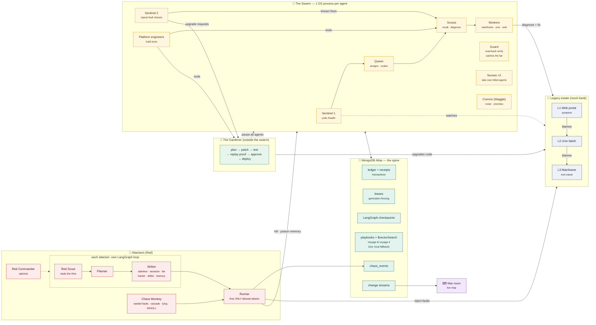

# Legacy Siege — architecture (Mermaid)

Renders natively on GitHub. Red attacks a mock legacy bank, the Blue swarm heals it, the Gardener upgrades the code, MongoDB Atlas is the spine.

```mermaid
flowchart LR
  subgraph RED["🔴 Attackers (Red)"]
    direction TB
    CM["Chaos Monkey<br/><small>seeded faults · cascade · lying · SIGKILL</small>"]
    CMD["Red Commander<br/><small>optional</small>"]
    subgraph LOOP["each attacker: own LangGraph loop"]
      direction TB
      RS["Red Scout<br/><small>reads the Hive</small>"] --> PL["Planner"] --> ST["Striker<br/><small>saboteur · assassin · liar<br/>hacker · drifter · memory</small>"]
    end
    RUN["Runner<br/><small>fires ONLY allowed attacks</small>"]
    CMD -.-> LOOP
    ST --> RUN
    CM --> RUN
  end

  subgraph SYS["🏦 Legacy estate (mock bank)"]
    direction TB
    L1["L1 Web portal<br/><small>symptom</small>"] -->|blames| L2["L2 Unix batch"] -->|blames| L3["L3 Mainframe<br/><small>root cause</small>"]
  end

  subgraph SWARM["🐝 The Swarm — 1 OS process per agent"]
    direction TB
    S1["Sentinel 1<br/><small>polls /health</small>"] --> Q["Queen<br/><small>assigns · scales</small>"]
    Q --> SC["Scouts<br/><small>recall · diagnose</small>"] --> W["Workers<br/><small>mainframe · unix · web</small>"]
    G["Guard<br/><small>read-back verify<br/>catches the liar</small>"]
    N["Nurses ×2<br/><small>take over killed agents</small>"]
    C["Comms (Waggle)<br/><small>roster · priorities</small>"]
    S2["Sentinel 2<br/><small>repeat fault classes</small>"]
    PE["Platform engineers<br/><small>build tools</small>"]
    S2 -->|known fixes| SC
    PE -->|tools| SC
  end

  subgraph GARD["🌱 The Gardener (outside the swarm)"]
    direction TB
    GP["plan → patch → test<br/>→ replay proof → approve → deploy"]
  end

  subgraph DB["🍃 MongoDB Atlas — the spine"]
    direction TB
    LED["ledger + receipts<br/><small>transactions</small>"]
    LEA["leases<br/><small>generation fencing</small>"]
    CK["LangGraph checkpoints"]
    PB["playbooks + $vectorSearch<br/><small>Voyage AI voyage-4<br/>(live: local fallback)</small>"]
    CE["chaos_events"]
    CS["change streams"]
  end

  WR["🗺️ War room<br/><small>live map</small>"]

  RUN -->|inject faults| SYS
  RUN -->|kill · poison memory| SWARM
  W -->|diagnose + fix| SYS
  S1 -.->|watches| SYS
  S2 -->|upgrade requests| GARD
  PE -->|tools| GARD
  GARD -->|pause all agents| SWARM
  GARD -->|upgrades code| SYS
  SWARM <--> DB
  RUN --> CE
  CS --> WR

  classDef red fill:#fdecec,stroke:#c62828,color:#5a0f0f
  classDef blue fill:#fff6e0,stroke:#d89a00,color:#4a3400
  classDef sys fill:#eef1f7,stroke:#3b4a6b,color:#1c2333
  classDef gard fill:#e8f5ec,stroke:#2e7d4f,color:#123d22
  classDef db fill:#e3f4ee,stroke:#00684a,color:#0b3b2b
  classDef wr fill:#f3e8fb,stroke:#7b3fa6,color:#3a1a52
  class CM,CMD,RS,PL,ST,RUN red
  class S1,Q,SC,W,G,N,C,S2,PE blue
  class L1,L2,L3 sys
  class GP gard
  class LED,LEA,CK,PB,CE,CS db
  class WR wr
```
